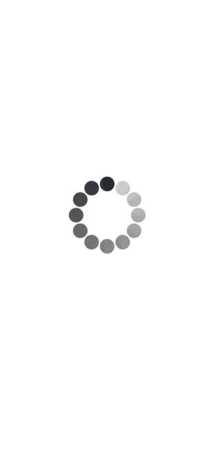
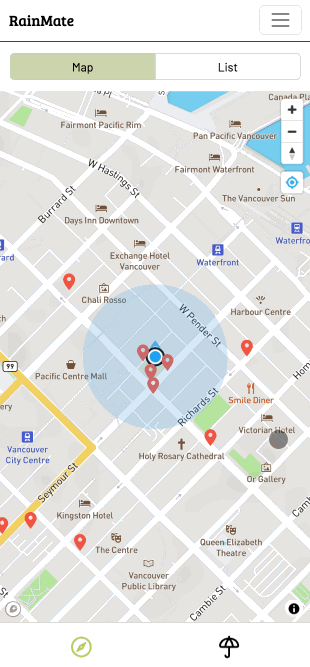
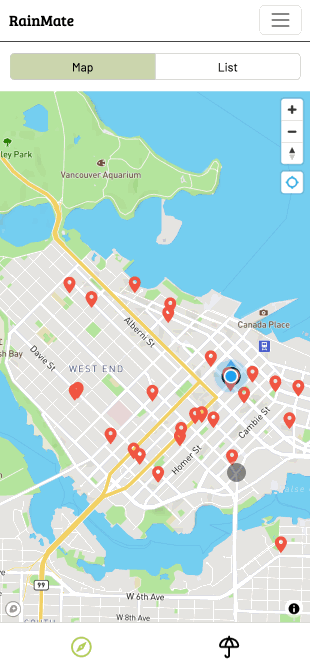
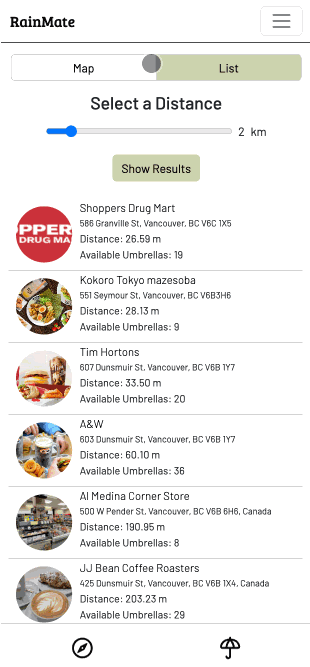
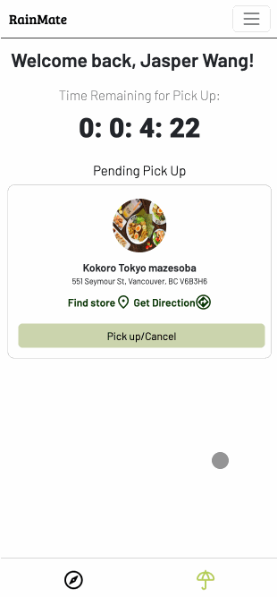
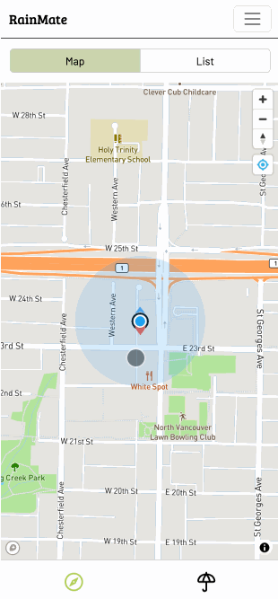

<div align="center">
<h1 align="center">

<h3>◦ Never Get Drenched Again</h3>
<h3>◦ Developed with the software and tools below.</h3>

<p align="center">


</p>


</div>

---

## 📖 Table of Contents

- [📖 Table of Contents](#-table-of-contents)
- [📍 Overview](#-overview)
- [🎈 Demo](#-demo)
- [📦 Features](#-features)
- [📂 Repository Structure](#-repository-structure)
- [🚀 Getting Started](#-getting-started)
  - [🔧 Installation](#-installation)
  - [🤖 Running RainMate](#-running-rainmate)
- [🛠️ Technologies and Resources Used](#technologies-and-resources-used)
- [⚠️ Known Bugs and Limitations](#known-bugs-and-limitations)
- [🛣 Roadmap](#-roadmap)
- [👏 Contributors](#-contributors)

---

## 📍 Overview

The RainMate app provides an umbrella-sharing service, enabling users to reserve and return umbrellas via a web-based platform. It features a main landing page, reservation details, confirmation with QR code generation for verification, and personal umbrella management. The service emphasizes eco-friendliness, affordability, and instant access, leveraging modern web technologies, geolocation, and real-time database interactions for a seamless user experience. RainMate caters to those needing temporary shelter from the rain, merging convenience with environmental consciousness.

---

## 🎈 Demo

Here is the link to the live demo of this app:

https://bcit-comp1800-dtc05-rainmate.web.app/

---

## 📦 Features

### Map View of Vendors

- upon opening the app, you can see all the participating vendors near you at a glance.

  

- You can click on the pin to see details with a popup.

  

- After dragging to a different location, a search area button will appear, and it allows user to search for vendors near this particular location.

  This is done using geohased user and vendor location to dynamically fetch appropriate vendors from Firestore.

  

### List View of Vendors

- at the top of the screen, users can navigate to the list view, and see all the vendors within the 2 km radius.

  - vendors are sorted by distance by default!
  - users are able to use the slider on the top to select the desired radius to search.

  

### Reserving an Umbrella

- Reserving an umbrella: user can easily reserve an umbrella by clicking a vendor, click **Reserve**, and a reservation document will be generated on Firestore. And, user will be shown a QR code generated using the _Reservation ID_.

  

### My Umbrella Page

- All your reservation information and remaining time for pickup or return, and pickup and return QR code are all available at a glance on this page!
- You can also click **Find Store** to direct you to the store you reserved your umbrella from.

  

### Picking Up an Umbrella

- To pickup an umbrella, simply open up the QR code, have it scanned by the vendor and complete the pickup!
- RainMate will update the vendor's umbrella count, and your pickup information at the same time.

  

### Returning an Umbrella

- Return an umbrella: return to any vendor you like! Go to any location, click on their vendor page in RainMate, you will see a **Return** button that allows you to return anywhere, anytime.

  

---

## 📂 Repository Structure

```sh
└── 1800_202330_DTC05/
    ├── components/
    │   ├── footerNav.html
    │   ├── nav_after_login.html
    │   └── nav_before_login.html
    ├── images/
    │   ├── icons/
    │   ├── vendors/
    ├── index.html
    ├── list.html
    ├── login.html
    ├── confirmation.html
    ├── main.html
    ├── my_umbrella.html
    ├── reservation.html
    ├── return.html
    ├── vendor.html
    ├── skeleton.html
    ├── scripts/
    │   ├── QR.js
    │   ├── authentication.js
    │   ├── confirmation.js
    │   ├── geohash-bundle.js
    │   ├── geohash-main.js
    │   ├── list.js
    │   ├── main.js
    │   ├── map.js
    │   ├── my_umbrella.js
    │   ├── qrcode.js
    │   ├── reservation.js
    │   ├── script.js
    │   ├── skeleton.js
    │   ├── timer.js
    │   └── vendor.js
    └── styles/
        └── style.css


```

---

## 🚀 Getting Started

**_Dependencies_**

Please ensure you have the following dependencies installed on your system:

`- ℹ️ Dependency: live-server`

### 🔧 Installation

1. Clone the 1800_202330_DTC05 repository:

```sh
git clone https://github.com/jasper-th-wang/1800_202330_DTC05
```

2. Change to the project directory:

```sh
cd 1800_202330_DTC05
```

### 🤖 Running RainMate

```sh
live-server .
```

---

## Technologies and Resources Used

Here is a list of technologies (with version numbers), API's, icons, fonts, images, media or data sources, and other resources that were used:

- HTML, CSS, JavaScript
- Bootstrap 5.0 (Frontend library)
- Firebase 8.0 (BAAS - Backend as a Service)
- Google Fonts: Barlow and Bree Serif
- MapBox GL JS API
- GeoFire.js 6.0
- QRCode.js
- Google Map Search data is used for mock Vendors information

---

## Known Bugs and Limitations

Here are some known bugs:

- When the timer is expired for return, there is no penalty or message indicating the fine user will receive for returning the umbrella late.
- If user enters the map page and quickly click the _list_ button to go to `list.html`, because `list.js` first uses user's location data from the session storage, it will rendered all the distance as "0 m" at first. However, `list.js` will update user's location data in the background to fix this error.
- Sometimes reservation QR code does not render on first load when user clicks on the _Pickup/Cancel_ button in `my_umbrella.html`, a refresh of the page is needed.

---

## 🛣 Roadmap

What we'd like to build in the future:

- Bug fixes: we want to optimize the user experience as much as possible by fixing the known bugs mentioned above.
- Query optimization: the amount of read query is more than desired, in the future we wish to optimize our query algorithm.
- Organization: due to time constraint and inexperience, the CSS and JavaScript code can benefit from a refactoring and reorganization!

---

## 👏 Contributors

- Jasper Wang 👋: jasper8777@icloud.com
- Flora Deng 👋: hdeng24@my.bcit.ca
- Joey Cho 👋: joeycho1208@gmail.com

[**Return**](#Top)

---
